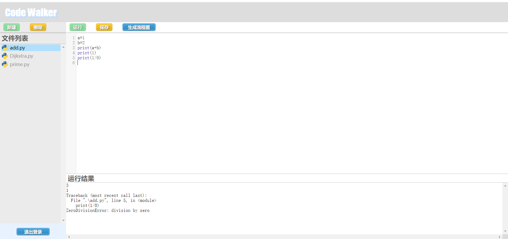
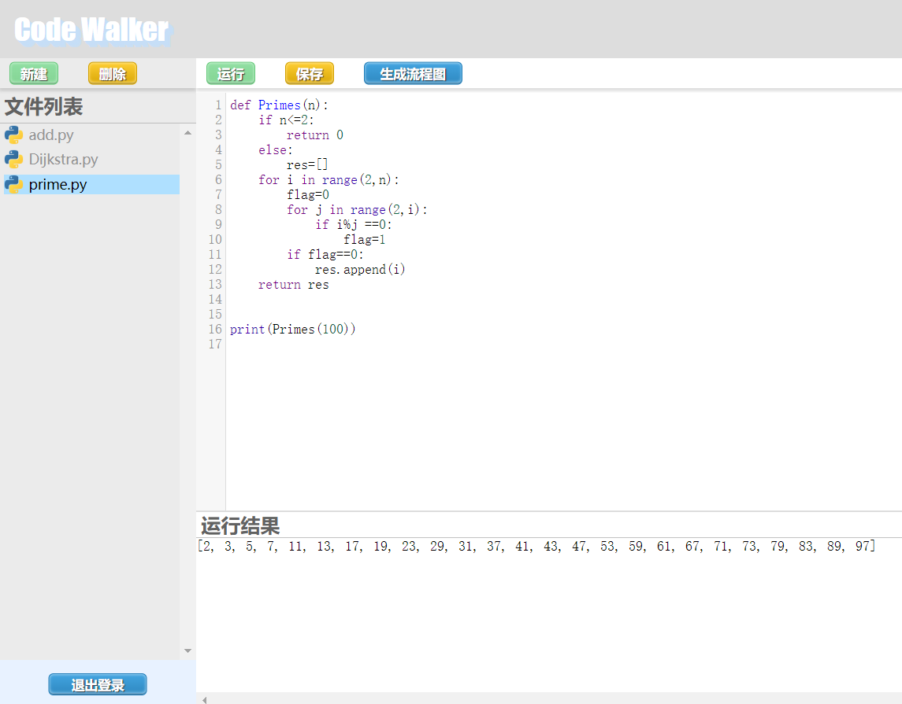
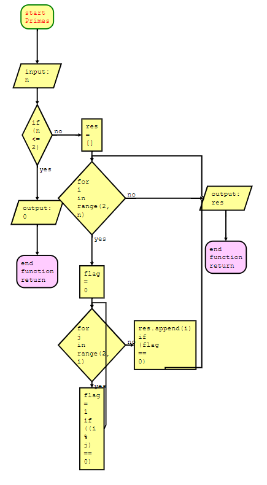

# Code Walker 

北京大学程序设计思维课程大作业

用python flask与html实现在线python网页编辑

利用CodeMirror来实现代码高亮

实现了代码自动联想补全

能够根据python代码生成流程图

效果图：



## 作业需求分析

规划需要实现的功能有：

1. **用户登录系统**：每个用户能够登录，拥有自己的工作空间。

   用数据库存储用户信息以及密码，以及网页上的界面登录

2. **代码高亮**：在编辑python代码时，能够对函数，变量，字符串等显示不同颜色

   使用第三方包CodeMirror，解析输入的代码，并自动添加html标签，实现不同颜色实现。

3. **代码自动补全**：能够通过输入的字符，识别可以补全的常用python函数及关键字，以及自定义变量名和函数名

   使用修改后的CodeMirror，添加python-hint.js来联想python的补全，添加相关代码获取所有已定义的变量和函数进行进一步联想

4. **代码自动联想查错**：对代码中的关键字等，推测其是否有拼写错误，如果有则将其标出

   使用编辑距离算法，判断代码中的关键字与python的关键字比对，若编辑距离<2，则将其标出波浪下划线

4. **运行代码显示结果**：能够在网页端运行代码并显示结果

   在服务端运行代码，重定向输出和错误输出流，获取程序输出信息，返回到网页

5. **流程图生成**：能够根据python代码的执行过程，生成程序的流程图
   用pyflowchart包，分析代码，生成markdown格式的flowchart文本，然后在网页上用外部代码flowchart.js来生成流程图

## 项目说明

python包需求：

```
flask
pyflowchart
json
sqlite3
```

**main.py**：flask主程序

**user_login.py**：控制用户登录相关功能的代码

**run_code.py**：控制运行和编辑代码相关功能的代码

**FLowChart.py**：生成流程图相关的代码

**DBdebug.py**：调试数据库代码


**users.db**：存储用户数据的数据库

**work/**：存储各个用户的工作目录


**static/editor.html**：编辑器主界面

**static/register_success.html**：注册成功页面

**static/repeat_login.html**：重复登录显示页面


**static/element.css**：编辑器元素的样式

**static/layout.css**：排版样式

**static/login.css**：登录注册界面样式


**static/python-hint.js**：用于进行python自动补全的javascript代码

static文件夹内其余文件均为第三方包的文件


**templates/flowchart.html**：流程图显示模板

**templates/index.html**：登陆界面

**templates/register.html**：注册界面


## 项目操作手册

运行服务器指令

```
python main.py
```

在浏览器输入```localhost```进入网页

首次进入需要先注册账号，或者使用测试账号

```
user: CaptainChen     pwd : 12345
user: Alice           pwd : 12345
```

在编辑器页面中，左侧为文件选择列表，右侧为代码编辑区域

上方有”新建“，”删除“，”运行“，”保存“，”生成流程图“按钮

运行，生成流程图等功能都必须在代码保存后进行

下方显示程序的运行结果

### 测试数据

测试账户

```
user: CaptainChen     pwd : 12345
user: Alice           pwd : 12345
```

测试用代码：

在CaptainChen用户中有```prime.py```代码，输出1~100的质数

可以运行该代码，生成该代码流程图，效果如下：

        

  


测试用代码```Dijkstra.py```，运行最短路算法。

测试用代码```add.py```，可以显示错误信息：

```
3
1
Traceback (most recent call last):
  File ".\add.py", line 5, in <module>
    print(1/0)
ZeroDivisionError: division by zero
```

